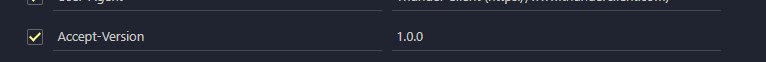

# Aplicación de Manejo de Incidencias

Este proyecto es un sistema de manejo de incidencias en áreas especificas  que permite a los usuarios reportar incidencias, especificar el área y revisar los docentes a cargo de dichas zonas . El sistema implementa autenticación basada en roles para acceder a los diferentes endpoints y también incluye un sistema de límite de peticiones para garantizar la seguridad y el uso eficiente de los recursos.

### INFORMACION DEL PROYECTO

Esta documentación describe una aplicación de manejo de incidencias construida utilizando Node.js, Express.js y MongoDB como base de datos. La aplicación cuenta con un sistema de autenticación basado en roles y utiliza las librerías `dotenv`, `express-session`, `jose`, `MongoDB`, `nodemon`, `express-rate-limit`, `passport`, `passport-http-bearer`.

## Requisitos previos

- Node js instalado en tu maquina (Recomendada v18.16.0)
- MongoDB instalado y configurado con las credenciales necesarias para conectarse a la base de datos.

## Instalación

**Repositorio a clonar:**

Clona este repositorio o descarga los archivos en tu máquina local.

- `https://github.com/C-jimenez21/mongoIncidencias`

**Instalación de dependencias:**

una vez clonado se procede a ejecutar el siguiente comando en la terminal:

```
npm install
```


## Instrucciones de uso

- Una vez instalado el proyecto se debe configurar las variables de entorno para ello crea el archivo **.env**, lo siguiente es la estructura que debe usar, también está en .env.example

```
MY_SERVER={"hostname":"uri-servidor", "port":"puerto de escucha"}
ATLAS_USER="Usuario de mongo"
ATLAS_PASSWORD="contraseña de mongo"
ATLAS_DATABASE="nombre de la base de datos de mongo (db_campus_incidencias)"
```


**Instalación de la base de datos:**

Para instalar la base de datos y configurar las tablas necesarias, sigue estos pasos:

1. Asegúrate de tener MongoDB instalado en tu sistema y que estas conectado.
2. Abre la carpeta `scripts`y el archivo `schema.mongodb`
3. A continuación selecciona todo el contenido y ejecutalo.
4. Realiza el procedimiento anterior pero para el otro archivo adjunto `incidencias.mongodb`

Una vez realizado todo el proceso tendrás la base datos `db_campus_incidencias` con sus respectivas tablas y datos en cada una de ellas para ejecutar las peticiones

**Arranque del programa:**

- iniciar nodemon que esta señalando a app.js :

  ```
  npm run dev
  ```

  

  El servidor debería iniciarse y estar listo para recibir solicitudes en la dirección `http://127.10.10.10:5050/` (puedes cambiar el puerto en el archivo `.env` si lo deseas).

- Thunder Client (extensión de Visual Studio Code) mostrará la respuesta de la solicitud en el panel de resultados. Aquí podrás ver el código de estado, los encabezados y el cuerpo de la respuesta. (agrega la solicitud HTTP para hacer las consultas, la URL se muestra despues de ejecutar nodemon en la consola asi: `Servidor activo en http://127.10.10.10:5050`

Una vez que observamos que el servidor esta activo procedemos a acceder a los router, sin embargo debemos generar el token antes por lo que procedemos:

#### **Ir el metodo POST **

Se debe generar el token según el rol al que queramos usar, dependiendo del nivel de autoridad prodremos acceder a ciertos routers.

```
http://127.10.10.10:5050/login
```


En la aplicación se definieron 3 roles

- Camper: el cual tiene acceso a las siguientes colecciones junto con sus versiones  y métodos colecciones 

  - `"/incidencia": ["1.0.0", "3.5.0", "get", "post"]`
  - ` "/area": ["1.0.0", "3.5.0", "get"]`
  - ` "/trainer": [ "3.5.0", "get"]`

  ```json
  {
    "ROL_EMAIL": "camper@example.com",
    "ROL_PASSWORD": "camper123"
  }
  ```

  

- Trainer:  el cual tiene acceso a las siguientes colecciones junto con sus versiones  y métodos colecciones 

  -  `"/incidencia": ["1.0.0", "3.5.0", "get", "post"]`
  - `"/area": [ "3.5.0", "get"]`
  - `"/trainer": ["1.0.0", "3.5.0", "get"]`

  ```json
  {
    "ROL_EMAIL": "trainer@example.com",
    "ROL_PASSWORD": "trainer123"
  }
  ```

  

- Admin: el cual tiene acceso a todas las colecciones, versiones y métodos.

  ```json
  {
    "ROL_EMAIL": "admin@example.com",
    "ROL_PASSWORD": "admin123"
  }
  ```

  

  Esta informacion debe ir en el body de nuestra peticion dado que va a verificar en la base de datos si este usuario se encuentra registrado.

  

Si todo sale bien, esto nos dara una serie de caracteres, estos conforman nuestro token

Procedemos a copiar el token y a colocarlo en la parte de headers mas concretamente como "Authorization" y debemos escribir bearer antes de pegar el token, se deberia ver mas o menos asi:

[](https://github.com/C-jimenez21/mongoCitas/blob/main/assets/bearer.png)

Posteriormente nos dirigimos al endpoint al cual le queramos realizar una peticion y si el rol tiene permisos sobre el endpoint, accederá de lo contrario te arrojara que no estas autorizado para acceder a este recurso.

Cabe recalcar que el token cuenta con un tiempo de duración de 5 min despues de esto expirara y tendras que generar otro

Ahora también se debe especificar las versiones del endpoint que se esta manejando, para ello debemos establecer en los headers "Accept-Version" y se especifica la version a la cual se quiere acceder, se deberia ver mas o menos asi:

​    

Si nuestro rol nos permite acceder a esta versión no dejara ingresar correctamente, de lo contrario nos negara el acceso a dicho endpoint con un mensaje como "This version is not allowed"

**Es de suma importancia recordar que de momento solo se están trabajando 2 versiones, la 1.0.0 y la 3.5.0, para que lo tengas en cuenta a la hora de realizar peticiones**

Para finalizar, debes recordar que los endpoints cuentan con un limite de peticiones que es de 20 cada minuto, si superas esta cantidad, el programa te enviara un mensaje declarando que haz excedido el limite de peticiones establecido, para volver a realizar dichas peticiones deberás esperar a que se reinicie el tiempo establecido

------


## Endpoints y Métodos

A continuación, se describen los endpoints disponibles en la aplicación junto con sus respectivos métodos HTTP y formatos de datos requeridos.

------

### Endpoint: incidencias

**Versión**: 1.0.0

* ***Lista todas las incidencias***

**Versión**: 3.5.0

* ***Lista todas las incidencias de mayor a menor según el nivel de gravedad***

​	**GET**

```bash
http://127.10.10.10:5050/incidencia
```

------

**Versión**: 1.0.0

* ***Lista todas las incidencias por id***
* `http://127.10.10.10:5050/incidencia/:id`

​	**GET**

```bash
http://127.10.10.10:5050/incidencia/3
```

**Versión**: 3.5.0

* ***Lista todas las incidencias por fecha***
* `http://127.10.10.10:5050/incidencia/:fecha`

​	**GET**

```bash
http://127.10.10.10:5050/incidencia/2023-08-23
```

------

**Versión**: 1.0.0

* ***Inserta una incidencia pero se tiene que especificar el id que tendrá y además se maneja la estructura de nombres que se usa en el backend***

```json
{
 	"id": 21,
 	"categoria": "leve",
 	"nivel": 2,
 	"fecha": "2023-07-20",
 	"lugar_incidencia":"endor",
 	"descripcion":"Reporte de lentitud en las computadoras."
}
```

**Versión**: 3.5.0

* ***Inserta una incidencia, pero el id se agregara automáticamente ademas la estructura de datos de envio es diferente a la del backend dotando esta version de mayor seguridad***

```json
{
 	"NIVEL_INICIDENCIA": 9,
    "CATEGORIA_INICIDENCIA": "critica",
    "FECHA_INCIDENCIA": "2023-08-06",
    "LUGAR_INCIDENCIA": "apolo",
    "DESCRIPCION": "Se partieron unos audifonos"
}
```

**POST**

```bash
http://127.10.10.10:5050/incidencia
```

------

### Endpoint: area

**Versión**: 1.0.0

* ***Lista todas las áreas registradas***

**Versión**: 3.5.0

* ***Lista todas los áreas registradas pero formateando su salida con valores diferentes a los del backend***

​	**GET**

```bash
http://127.10.10.10:5050/area
```

------

**Versión**: 1.0.0

* ***Lista todas las áreas por id***
* `http://127.10.10.10:5050/area/:id`

​	**GET**

```bash
http://127.10.10.10:5050/area/2
```

------

**Versión**: 3.5.0

* ***Inserta un nuevo PC en un área ya existente***

```json
{
 	"AREA": "review1",
    "ROOM": "endor",
    "PC_CODE": "PC3",
    "PC_KEYBOARD": "TEC3",
    "PC_MOUSE": "MOU3",
    "PC_HEADPHONES": "DIA3"
}
```

**POST**

```bash
http://127.10.10.10:5050/area
```

------


### Endpoint: trainer

**Versión**: 1.0.0

* ***Lista todas los trainers registrados***

**Versión**: 3.5.0

* ***Lista todas los trainers registrados pero formateando su salida con valores diferentes a los del backend***

​	**GET**

```bash
http://127.10.10.10:5050/trainer
```

------

**Versión**: 1.0.0

* ***Lista todas los trainers por id***
* `http://127.10.10.10:5050/trainer/:id`

​	**GET**

```bash
http://127.10.10.10:5050/area/2
```

------

**Versión**: 3.5.0

* ***Inserta un trainer, pero el id se agregara automaticamente ademas la estructura de datos de envio es diferente a la del backend dotando esta version de mayor seguridad***

```json
{
 	"TRAINER_NAME": "Miguel Castro",
    "PERSONAL_EMAIL": "miguel.castro@example.com",
    "CORPORATIVO_EMAIL": "miguel.castro@empresa.com",
    "MOVIL_PHONE": "+3202225556",
    "RESIDENCIA_PHONE": "+3215556996",
    "EMPRESA_PHONE": "+3188989966",
    "MOVIL_EMPRESA_PHONE":"+3112559896"
}
```

**POST**

```bash
http://127.10.10.10:5050/trainer
```

------


## Contacto

Si tienes alguna pregunta o comentario sobre esta aplicación, no dudes en ponerte en contacto con nosotros a través de [cristianjj21@gmail.com](mailto:cristianjj21@gmail.com). ¡Esperamos que disfrutes usando nuestra aplicación de agendamiento de citas odontológicas!
